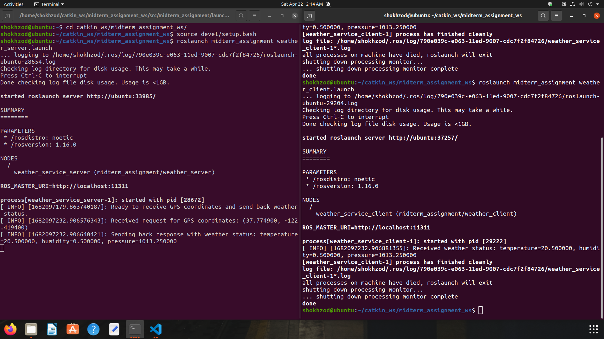
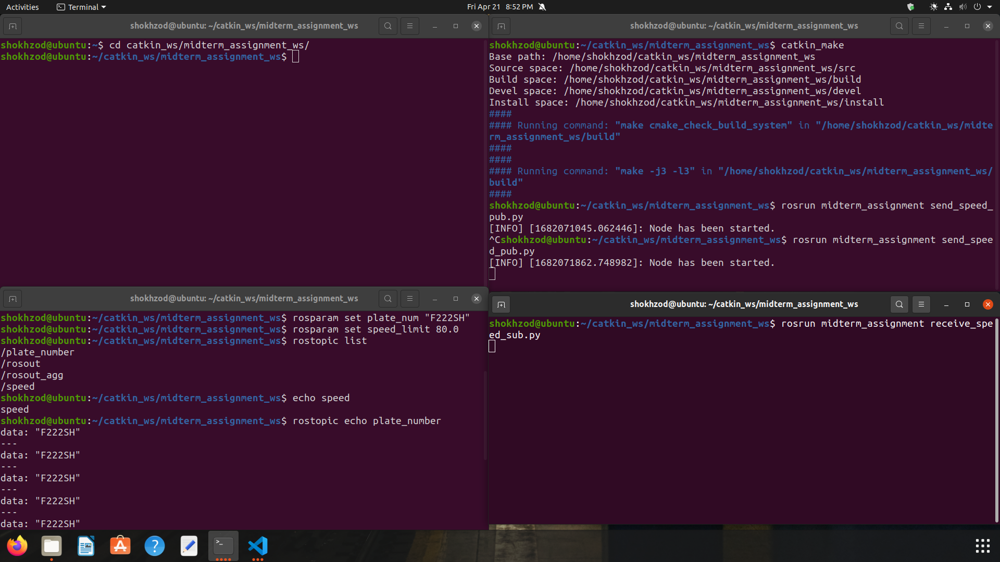
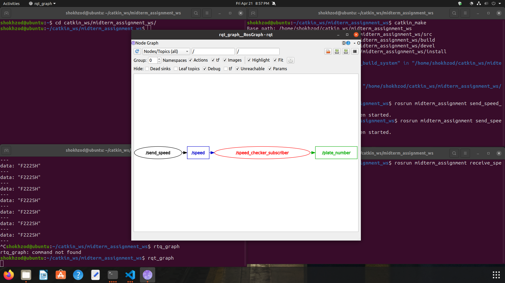
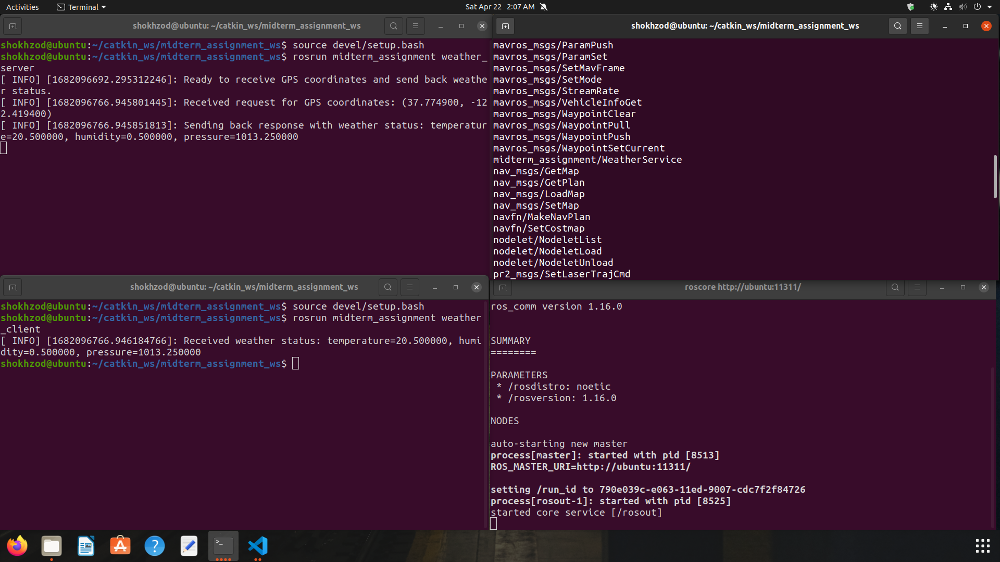

## Midterm Assignment 

# ROS Package for Weather Service

This ROS package provides a service that receives GPS location from a client node and responds with the current weather status at that location.

## Prerequisites

This package is designed to work with ROS (Robot Operating System) and requires the following dependencies:

- ROS Kinetic/Melodic/Noetic (depending on your system)
- `catkin` package for building the ROS workspace

## Installation

1. Clone this repository into your ROS workspace.
2. Run `catkin_make` in your workspace to build the package.
3. Source your ROS workspace: `source <path-to-your-workspace>/devel/setup.bash`.

## Usage

To use the weather service, you will need to run both the client and server nodes.

### Server Node

The server node provides the weather service and must be running in order for the client node to receive weather data.

To run the server node, use the following command:
``` 
$ rosrun midterm_assignment weather_server
```
### Client Node

The client node sends GPS location to the server node and receives weather data in response.

To run the client node, use the following command:
```
$ rosrun midterm_assignment weather_client
```
## Parameters

The following parameters can be set in the `launch` files:

- `gps_topic` (default: `/gps_location`): The topic name to which the client node publishes the GPS location.
- `weather_topic` (default: `/weather_data`): The topic name to which the server node publishes the weather data.
- `service_name` (default: `/weather_service`): The service name used by the client node to request weather data from the server node.

## Launch Files

This package provides two launch files:

- `weather_service.launch`: Launches both the client and server nodes.
- `weather_server.launch`: Launches only the server node.

## Service Messages

This package defines the following service message:

- `WeatherService`: Receives GPS location and returns weather data.

## Author

This ROS package was created by Khaydarov Shokhzod.


###LaunchTestComplete


### midterm_PlateNum


###LaunchTestComplete


### Plate_RQT_graph


### Disclamer:
I used some help from ChatGPT to Write the README.md file properly. I corrected and modified most of the generated code by myself.
