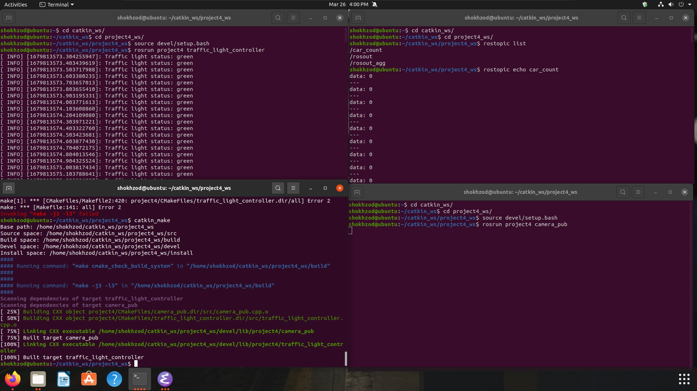

# Homework 1:
## New Idea is connecting Camera input to Traffic light control pannel.
Camera -> Publisher.
Traffic Light Controller -> Subscriber.

## Media:




<iframe width="560" height="315" src="https://www.youtube-nocookie.com/embed/ApuUxrqTN1k" title="YouTube video player" frameborder="0" allow="accelerometer; autoplay; clipboard-write; encrypted-media; gyroscope; picture-in-picture; web-share" allowfullscreen></iframe>


## Code

### Camera:

```c++
#include <ros/ros.h>
#include <std_msgs/Int32.h>

int main(int argc, char** argv)
{
    ros::init(argc, argv, "camera_publisher");
    ros::NodeHandle nh;

    ros::Publisher car_count_pub = nh.advertise<std_msgs::Int32>("car_count", 10);

    ros::Rate loop_rate(10);

    while (ros::ok())
    {
        // Simulate car detection and count
        int car_count = 0; // Replace with real detection method

        std_msgs::Int32 msg;
        msg.data = car_count;

        car_count_pub.publish(msg);

        ros::spinOnce();
        loop_rate.sleep();
    }

    return 0;
}
```
### Traffic Light Controller:

```C++
#include <ros/ros.h>
#include <std_msgs/Int32.h>
#include <std_msgs/String.h>

void carCountCallback(const std_msgs::Int32::ConstPtr& msg)
{
    // Determine traffic light status based on car count
    std_msgs::String light_msg;
    if (msg->data > 0)
    {
        light_msg.data = "red";
    }
    else
    {
        light_msg.data = "green";
    }

    ROS_INFO("Traffic light status: %s", light_msg.data.c_str());
}

int main(int argc, char** argv)
{
    ros::init(argc, argv, "traffic_light_controller");
    ros::NodeHandle nh;

    ros::Subscriber car_count_sub = nh.subscribe("car_count", 10, carCountCallback);

    ros::spin();

    return 0;
}

```


