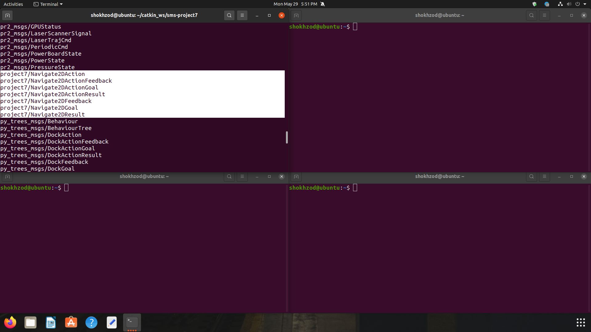
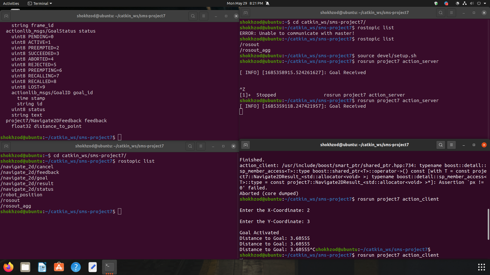
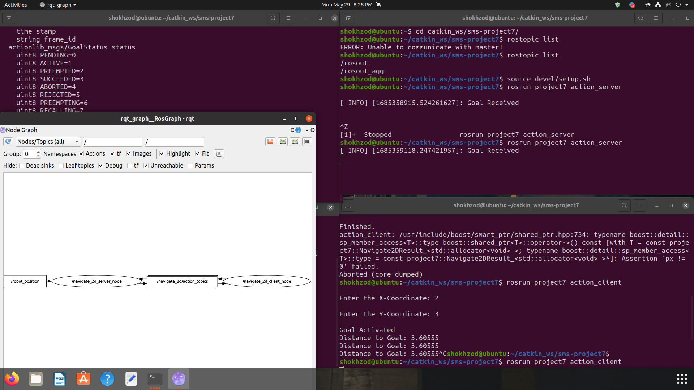
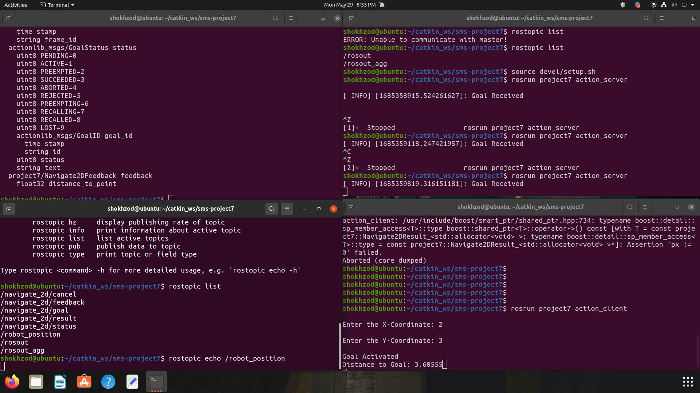

# Assignment Project7:

### Screenshot:






## How I did:
``` 
shokhzod@ubuntu:~$ ls
catkin_ws  Dockerfile  Downloads              Music     Public  Templates
Desktop    Documents   install_ros_noetic.sh  Pictures  snap    Videos
shokhzod@ubuntu:~$ cd catkin_ws/
shokhzod@ubuntu:~/catkin_ws$ ls
homework1_ws  homework3_ws  midterm_assignment_ws  README.md     trip_params.yaml
homework2_ws  homework4_ws  project5_ws            sms-project2
shokhzod@ubuntu:~/catkin_ws$ gti status

Command 'gti' not found, did you mean:

  command 'gtg' from snap getting-things-gnome (0.6)
  command 'gtv' from deb smpeg-gtv (0.4.5+cvs20030824-8build1)
  command 'gt' from deb genometools (1.6.1+ds-2)
  command 'gtf' from deb xserver-xorg-core (2:1.20.13-1ubuntu1~20.04.8)
  command 'gmi' from deb gmailieer (0.10-1)
  command 'gsi' from deb gambc (4.8.8-3.1)
  command 'gli' from deb ruby-gli (2.14.0-1)
  command 'bti' from deb bti (034-4build1)
  command 'gt5' from deb gt5 (1.5.0~20111220+bzr29-3)
  command 'git' from deb git (1:2.25.1-1ubuntu3.11)
  command 'gth' from deb genomethreader (1.7.3+dfsg-5)
  command 'ti' from deb ticgit (1.0.2.17-2.1)
  command 'ghi' from deb ghi (1.2.0-1)

See 'snap info <snapname>' for additional versions.

shokhzod@ubuntu:~/catkin_ws$ git status
On branch main
Your branch is up to date with 'origin/main'.

Changes not staged for commit:
  (use "git add <file>..." to update what will be committed)
  (use "git restore <file>..." to discard changes in working directory)
  (commit or discard the untracked or modified content in submodules)
	modified:   project5_ws/sms-project5 (untracked content)

no changes added to commit (use "git add" and/or "git commit -a")
shokhzod@ubuntu:~/catkin_ws$ git clone https://github.com/online-courses-materials/sms-project7.git
Cloning into 'sms-project7'...
remote: Enumerating objects: 24, done.
remote: Counting objects: 100% (24/24), done.
remote: Compressing objects: 100% (21/21), done.
remote: Total 24 (delta 4), reused 12 (delta 0), pack-reused 0
Unpacking objects: 100% (24/24), 10.93 KiB | 1.56 MiB/s, done.
shokhzod@ubuntu:~/catkin_ws$ ls
homework1_ws  homework3_ws  midterm_assignment_ws  README.md     sms-project7
homework2_ws  homework4_ws  project5_ws            sms-project2  trip_params.yaml
shokhzod@ubuntu:~/catkin_ws$ cd sms-project7
shokhzod@ubuntu:~/catkin_ws/sms-project7$ ls
README.md  src
shokhzod@ubuntu:~/catkin_ws/sms-project7$ catkin_make
Base path: /home/shokhzod/catkin_ws/sms-project7
Source space: /home/shokhzod/catkin_ws/sms-project7/src
Build space: /home/shokhzod/catkin_ws/sms-project7/build
Devel space: /home/shokhzod/catkin_ws/sms-project7/devel
Install space: /home/shokhzod/catkin_ws/sms-project7/install
####
#### Running command: "cmake /home/shokhzod/catkin_ws/sms-project7/src -DCATKIN_DEVEL_PREFIX=/home/shokhzod/catkin_ws/sms-project7/devel -DCMAKE_INSTALL_PREFIX=/home/shokhzod/catkin_ws/sms-project7/install -G Unix Makefiles" in "/home/shokhzod/catkin_ws/sms-project7/build"
####
-- The C compiler identification is GNU 9.4.0
-- The CXX compiler identification is GNU 9.4.0
-- Check for working C compiler: /usr/bin/cc
-- Check for working C compiler: /usr/bin/cc -- works
-- Detecting C compiler ABI info
-- Detecting C compiler ABI info - done
-- Detecting C compile features
-- Detecting C compile features - done
-- Check for working CXX compiler: /usr/bin/c++
-- Check for working CXX compiler: /usr/bin/c++ -- works
-- Detecting CXX compiler ABI info
-- Detecting CXX compiler ABI info - done
-- Detecting CXX compile features
-- Detecting CXX compile features - done
-- Using CATKIN_DEVEL_PREFIX: /home/shokhzod/catkin_ws/sms-project7/devel
-- Using CMAKE_PREFIX_PATH: /home/shokhzod/catkin_ws/midterm_assignment_ws/devel;/home/shokhzod/catkin_ws/homework2_ws/devel;/opt/ros/noetic
-- This workspace overlays: /home/shokhzod/catkin_ws/midterm_assignment_ws/devel;/home/shokhzod/catkin_ws/homework2_ws/devel;/opt/ros/noetic
-- Found PythonInterp: /usr/bin/python3 (found suitable version "3.8.10", minimum required is "3") 
-- Using PYTHON_EXECUTABLE: /usr/bin/python3
-- Using Debian Python package layout
-- Found PY_em: /usr/lib/python3/dist-packages/em.py  
-- Using empy: /usr/lib/python3/dist-packages/em.py
-- Using CATKIN_ENABLE_TESTING: ON
-- Call enable_testing()
-- Using CATKIN_TEST_RESULTS_DIR: /home/shokhzod/catkin_ws/sms-project7/build/test_results
-- Forcing gtest/gmock from source, though one was otherwise available.
-- Found gtest sources under '/usr/src/googletest': gtests will be built
-- Found gmock sources under '/usr/src/googletest': gmock will be built
-- Found PythonInterp: /usr/bin/python3 (found version "3.8.10") 
-- Found Threads: TRUE  
-- Using Python nosetests: /usr/bin/nosetests3
-- catkin 0.8.10
-- BUILD_SHARED_LIBS is on
-- BUILD_SHARED_LIBS is on
-- ~~~~~~~~~~~~~~~~~~~~~~~~~~~~~~~~~~~~~~~~~~~~~~~~~
-- ~~  traversing 1 packages in topological order:
-- ~~  - project7
-- ~~~~~~~~~~~~~~~~~~~~~~~~~~~~~~~~~~~~~~~~~~~~~~~~~
-- +++ processing catkin package: 'project7'
-- ==> add_subdirectory(project7)
-- Using these message generators: gencpp;geneus;genlisp;gennodejs;genpy
-- Generating .msg files for action project7/Navigate2D /home/shokhzod/catkin_ws/sms-project7/src/project7/action/Navigate2D.action
Generating for action Navigate2D
-- project7: 7 messages, 0 services
-- Configuring done
-- Generating done
-- Build files have been written to: /home/shokhzod/catkin_ws/sms-project7/build
####
#### Running command: "make -j4 -l4" in "/home/shokhzod/catkin_ws/sms-project7/build"
####
Scanning dependencies of target sensor_msgs_generate_messages_cpp
Scanning dependencies of target _project7_generate_messages_check_deps_Navigate2DFeedback
Scanning dependencies of target _project7_generate_messages_check_deps_Navigate2DActionGoal
Scanning dependencies of target _project7_generate_messages_check_deps_Navigate2DAction
[  0%] Built target sensor_msgs_generate_messages_cpp
Scanning dependencies of target actionlib_msgs_generate_messages_cpp
[  0%] Built target actionlib_msgs_generate_messages_cpp
[  0%] Built target _project7_generate_messages_check_deps_Navigate2DActionGoal
[  0%] Built target _project7_generate_messages_check_deps_Navigate2DAction
[  0%] Built target _project7_generate_messages_check_deps_Navigate2DFeedback
Scanning dependencies of target std_msgs_generate_messages_cpp
Scanning dependencies of target _project7_generate_messages_check_deps_Navigate2DResult
Scanning dependencies of target _project7_generate_messages_check_deps_Navigate2DGoal
Scanning dependencies of target _project7_generate_messages_check_deps_Navigate2DActionResult
[  0%] Built target std_msgs_generate_messages_cpp
Scanning dependencies of target _project7_generate_messages_check_deps_Navigate2DActionFeedback
[  0%] Built target _project7_generate_messages_check_deps_Navigate2DGoal
[  0%] Built target _project7_generate_messages_check_deps_Navigate2DResult
[  0%] Built target _project7_generate_messages_check_deps_Navigate2DActionResult
Scanning dependencies of target sensor_msgs_generate_messages_eus
Scanning dependencies of target actionlib_msgs_generate_messages_eus
Scanning dependencies of target std_msgs_generate_messages_eus
[  0%] Built target sensor_msgs_generate_messages_eus
[  0%] Built target actionlib_msgs_generate_messages_eus
[  0%] Built target std_msgs_generate_messages_eus
Scanning dependencies of target sensor_msgs_generate_messages_lisp
Scanning dependencies of target actionlib_msgs_generate_messages_lisp
Scanning dependencies of target std_msgs_generate_messages_lisp
[  0%] Built target _project7_generate_messages_check_deps_Navigate2DActionFeedback
[  0%] Built target actionlib_msgs_generate_messages_lisp
[  0%] Built target sensor_msgs_generate_messages_lisp
[  0%] Built target std_msgs_generate_messages_lisp
Scanning dependencies of target std_msgs_generate_messages_nodejs
Scanning dependencies of target actionlib_msgs_generate_messages_nodejs
Scanning dependencies of target sensor_msgs_generate_messages_nodejs
Scanning dependencies of target std_msgs_generate_messages_py
[  0%] Built target std_msgs_generate_messages_nodejs
[  0%] Built target actionlib_msgs_generate_messages_nodejs
[  0%] Built target sensor_msgs_generate_messages_nodejs
[  0%] Built target std_msgs_generate_messages_py
Scanning dependencies of target sensor_msgs_generate_messages_py
Scanning dependencies of target actionlib_msgs_generate_messages_py
Scanning dependencies of target project7_generate_messages_cpp
Scanning dependencies of target project7_generate_messages_eus
[  0%] Built target sensor_msgs_generate_messages_py
[  0%] Built target actionlib_msgs_generate_messages_py
[  2%] Generating C++ code from project7/Navigate2DAction.msg
[  4%] Generating EusLisp code from project7/Navigate2DAction.msg
Scanning dependencies of target project7_generate_messages_lisp
Scanning dependencies of target project7_generate_messages_nodejs
[  7%] Generating Lisp code from project7/Navigate2DAction.msg
[  9%] Generating Javascript code from project7/Navigate2DAction.msg
[ 12%] Generating Lisp code from project7/Navigate2DActionGoal.msg
[ 14%] Generating Javascript code from project7/Navigate2DActionGoal.msg
[ 17%] Generating EusLisp code from project7/Navigate2DActionGoal.msg
[ 19%] Generating C++ code from project7/Navigate2DActionGoal.msg
[ 21%] Generating Lisp code from project7/Navigate2DActionResult.msg
[ 24%] Generating Javascript code from project7/Navigate2DActionResult.msg
[ 26%] Generating Lisp code from project7/Navigate2DActionFeedback.msg
[ 29%] Generating EusLisp code from project7/Navigate2DActionResult.msg
[ 31%] Generating Javascript code from project7/Navigate2DActionFeedback.msg
[ 34%] Generating C++ code from project7/Navigate2DActionResult.msg
[ 36%] Generating Lisp code from project7/Navigate2DGoal.msg
[ 39%] Generating Javascript code from project7/Navigate2DGoal.msg
[ 41%] Generating EusLisp code from project7/Navigate2DActionFeedback.msg
[ 43%] Generating Lisp code from project7/Navigate2DResult.msg
[ 46%] Generating Javascript code from project7/Navigate2DResult.msg
[ 48%] Generating C++ code from project7/Navigate2DActionFeedback.msg
[ 51%] Generating Lisp code from project7/Navigate2DFeedback.msg
[ 53%] Generating Javascript code from project7/Navigate2DFeedback.msg
[ 56%] Generating EusLisp code from project7/Navigate2DGoal.msg
[ 56%] Built target project7_generate_messages_lisp
Scanning dependencies of target project7_generate_messages_py
[ 58%] Generating Python from MSG project7/Navigate2DAction
[ 58%] Built target project7_generate_messages_nodejs
[ 60%] Generating Python from MSG project7/Navigate2DActionGoal
[ 63%] Generating C++ code from project7/Navigate2DGoal.msg
[ 65%] Generating EusLisp code from project7/Navigate2DResult.msg
[ 68%] Generating EusLisp code from project7/Navigate2DFeedback.msg
[ 70%] Generating C++ code from project7/Navigate2DResult.msg
[ 73%] Generating C++ code from project7/Navigate2DFeedback.msg
[ 75%] Generating Python from MSG project7/Navigate2DActionResult
[ 78%] Generating EusLisp manifest code for project7
[ 80%] Generating Python from MSG project7/Navigate2DActionFeedback
[ 80%] Built target project7_generate_messages_cpp
Scanning dependencies of target action_server
[ 82%] Building CXX object project7/CMakeFiles/action_server.dir/src/action_server.cpp.o
[ 85%] Generating Python from MSG project7/Navigate2DGoal
[ 87%] Generating Python from MSG project7/Navigate2DResult
[ 90%] Generating Python from MSG project7/Navigate2DFeedback
[ 90%] Built target project7_generate_messages_eus
Scanning dependencies of target action_client
[ 92%] Building CXX object project7/CMakeFiles/action_client.dir/src/action_client.cpp.o
[ 95%] Generating Python msg __init__.py for project7
[ 95%] Built target project7_generate_messages_py
Scanning dependencies of target project7_generate_messages
[ 95%] Built target project7_generate_messages
[ 97%] Linking CXX executable /home/shokhzod/catkin_ws/sms-project7/devel/lib/project7/action_server
[ 97%] Built target action_server
[100%] Linking CXX executable /home/shokhzod/catkin_ws/sms-project7/devel/lib/project7/action_client
[100%] Built target action_client
shokhzod@ubuntu:~/catkin_ws/sms-project7$ source devel/setup.bash
shokhzod@ubuntu:~/catkin_ws/sms-project7$ rosmsg list
actionlib/TestAction
actionlib/TestActionFeedback
actionlib/TestActionGoal
actionlib/TestActionResult
actionlib/TestFeedback
actionlib/TestGoal
actionlib/TestRequestAction
actionlib/TestRequestActionFeedback
actionlib/TestRequestActionGoal
actionlib/TestRequestActionResult
actionlib/TestRequestFeedback
actionlib/TestRequestGoal
actionlib/TestRequestResult
actionlib/TestResult
actionlib/TwoIntsAction
actionlib/TwoIntsActionFeedback
actionlib/TwoIntsActionGoal
actionlib/TwoIntsActionResult
actionlib/TwoIntsFeedback
actionlib/TwoIntsGoal
actionlib/TwoIntsResult
actionlib_msgs/GoalID
actionlib_msgs/GoalStatus
actionlib_msgs/GoalStatusArray
actionlib_tutorials/AveragingAction
actionlib_tutorials/AveragingActionFeedback
actionlib_tutorials/AveragingActionGoal
actionlib_tutorials/AveragingActionResult
actionlib_tutorials/AveragingFeedback
actionlib_tutorials/AveragingGoal
actionlib_tutorials/AveragingResult
actionlib_tutorials/FibonacciAction
actionlib_tutorials/FibonacciActionFeedback
actionlib_tutorials/FibonacciActionGoal
actionlib_tutorials/FibonacciActionResult
actionlib_tutorials/FibonacciFeedback
actionlib_tutorials/FibonacciGoal
actionlib_tutorials/FibonacciResult
base_local_planner/Position2DInt
bond/Constants
bond/Status
control_msgs/FollowJointTrajectoryAction
control_msgs/FollowJointTrajectoryActionFeedback
control_msgs/FollowJointTrajectoryActionGoal
control_msgs/FollowJointTrajectoryActionResult
control_msgs/FollowJointTrajectoryFeedback
control_msgs/FollowJointTrajectoryGoal
control_msgs/FollowJointTrajectoryResult
control_msgs/GripperCommand
control_msgs/GripperCommandAction
control_msgs/GripperCommandActionFeedback
control_msgs/GripperCommandActionGoal
control_msgs/GripperCommandActionResult
control_msgs/GripperCommandFeedback
control_msgs/GripperCommandGoal
control_msgs/GripperCommandResult
control_msgs/JointControllerState
control_msgs/JointJog
control_msgs/JointTolerance
control_msgs/JointTrajectoryAction
control_msgs/JointTrajectoryActionFeedback
control_msgs/JointTrajectoryActionGoal
control_msgs/JointTrajectoryActionResult
control_msgs/JointTrajectoryControllerState
control_msgs/JointTrajectoryFeedback
control_msgs/JointTrajectoryGoal
control_msgs/JointTrajectoryResult
control_msgs/PidState
control_msgs/PointHeadAction
control_msgs/PointHeadActionFeedback
control_msgs/PointHeadActionGoal
control_msgs/PointHeadActionResult
control_msgs/PointHeadFeedback
control_msgs/PointHeadGoal
control_msgs/PointHeadResult
control_msgs/SingleJointPositionAction
control_msgs/SingleJointPositionActionFeedback
control_msgs/SingleJointPositionActionGoal
control_msgs/SingleJointPositionActionResult
control_msgs/SingleJointPositionFeedback
control_msgs/SingleJointPositionGoal
control_msgs/SingleJointPositionResult
controller_manager_msgs/ControllerState
controller_manager_msgs/ControllerStatistics
controller_manager_msgs/ControllersStatistics
controller_manager_msgs/HardwareInterfaceResources
costmap_2d/VoxelGrid
diagnostic_msgs/DiagnosticArray
diagnostic_msgs/DiagnosticStatus
diagnostic_msgs/KeyValue
dynamic_reconfigure/BoolParameter
dynamic_reconfigure/Config
dynamic_reconfigure/ConfigDescription
dynamic_reconfigure/DoubleParameter
dynamic_reconfigure/Group
dynamic_reconfigure/GroupState
dynamic_reconfigure/IntParameter
dynamic_reconfigure/ParamDescription
dynamic_reconfigure/SensorLevels
dynamic_reconfigure/StrParameter
geographic_msgs/BoundingBox
geographic_msgs/GeoPath
geographic_msgs/GeoPoint
geographic_msgs/GeoPointStamped
geographic_msgs/GeoPose
geographic_msgs/GeoPoseStamped
geographic_msgs/GeographicMap
geographic_msgs/GeographicMapChanges
geographic_msgs/KeyValue
geographic_msgs/MapFeature
geographic_msgs/RouteNetwork
geographic_msgs/RoutePath
geographic_msgs/RouteSegment
geographic_msgs/WayPoint
geometry_msgs/Accel
geometry_msgs/AccelStamped
geometry_msgs/AccelWithCovariance
geometry_msgs/AccelWithCovarianceStamped
geometry_msgs/Inertia
geometry_msgs/InertiaStamped
geometry_msgs/Point
geometry_msgs/Point32
geometry_msgs/PointStamped
geometry_msgs/Polygon
geometry_msgs/PolygonStamped
geometry_msgs/Pose
geometry_msgs/Pose2D
geometry_msgs/PoseArray
geometry_msgs/PoseStamped
geometry_msgs/PoseWithCovariance
geometry_msgs/PoseWithCovarianceStamped
geometry_msgs/Quaternion
geometry_msgs/QuaternionStamped
geometry_msgs/Transform
geometry_msgs/TransformStamped
geometry_msgs/Twist
geometry_msgs/TwistStamped
geometry_msgs/TwistWithCovariance
geometry_msgs/TwistWithCovarianceStamped
geometry_msgs/Vector3
geometry_msgs/Vector3Stamped
geometry_msgs/Wrench
geometry_msgs/WrenchStamped
hri_msgs/AudioFeatures
hri_msgs/BodyPosture
hri_msgs/EngagementLevel
hri_msgs/Expression
hri_msgs/FacialActionUnits
hri_msgs/FacialLandmarks
hri_msgs/Gaze
hri_msgs/Gesture
hri_msgs/Group
hri_msgs/IdsList
hri_msgs/IdsMatch
hri_msgs/LiveSpeech
hri_msgs/NormalizedPointOfInterest2D
hri_msgs/NormalizedPointOfInterest2DStamped
hri_msgs/NormalizedRegionOfInterest2D
hri_msgs/Skeleton2D
hri_msgs/SoftBiometrics
map_msgs/OccupancyGridUpdate
map_msgs/PointCloud2Update
map_msgs/ProjectedMap
map_msgs/ProjectedMapInfo
mavros_msgs/ADSBVehicle
mavros_msgs/ActuatorControl
mavros_msgs/Altitude
mavros_msgs/AttitudeTarget
mavros_msgs/BatteryStatus
mavros_msgs/CamIMUStamp
mavros_msgs/CameraImageCaptured
mavros_msgs/CellularStatus
mavros_msgs/CommandCode
mavros_msgs/CompanionProcessStatus
mavros_msgs/DebugValue
mavros_msgs/ESCInfo
mavros_msgs/ESCInfoItem
mavros_msgs/ESCStatus
mavros_msgs/ESCStatusItem
mavros_msgs/ESCTelemetry
mavros_msgs/ESCTelemetryItem
mavros_msgs/EstimatorStatus
mavros_msgs/ExtendedState
mavros_msgs/FileEntry
mavros_msgs/GPSINPUT
mavros_msgs/GPSRAW
mavros_msgs/GPSRTK
mavros_msgs/GlobalPositionTarget
mavros_msgs/HilActuatorControls
mavros_msgs/HilControls
mavros_msgs/HilGPS
mavros_msgs/HilSensor
mavros_msgs/HilStateQuaternion
mavros_msgs/HomePosition
mavros_msgs/LandingTarget
mavros_msgs/LogData
mavros_msgs/LogEntry
mavros_msgs/MagnetometerReporter
mavros_msgs/ManualControl
mavros_msgs/Mavlink
mavros_msgs/MountControl
mavros_msgs/NavControllerOutput
mavros_msgs/OnboardComputerStatus
mavros_msgs/OpticalFlowRad
mavros_msgs/OverrideRCIn
mavros_msgs/Param
mavros_msgs/ParamValue
mavros_msgs/PlayTuneV2
mavros_msgs/PositionTarget
mavros_msgs/RCIn
mavros_msgs/RCOut
mavros_msgs/RTCM
mavros_msgs/RTKBaseline
mavros_msgs/RadioStatus
mavros_msgs/State
mavros_msgs/StatusText
mavros_msgs/TerrainReport
mavros_msgs/Thrust
mavros_msgs/TimesyncStatus
mavros_msgs/Trajectory
mavros_msgs/Tunnel
mavros_msgs/VFR_HUD
mavros_msgs/VehicleInfo
mavros_msgs/Vibration
mavros_msgs/Waypoint
mavros_msgs/WaypointList
mavros_msgs/WaypointReached
mavros_msgs/WheelOdomStamped
midterm_assignment/Weather
move_base_msgs/MoveBaseAction
move_base_msgs/MoveBaseActionFeedback
move_base_msgs/MoveBaseActionGoal
move_base_msgs/MoveBaseActionResult
move_base_msgs/MoveBaseFeedback
move_base_msgs/MoveBaseGoal
move_base_msgs/MoveBaseResult
move_base_msgs/RecoveryStatus
nav_msgs/GetMapAction
nav_msgs/GetMapActionFeedback
nav_msgs/GetMapActionGoal
nav_msgs/GetMapActionResult
nav_msgs/GetMapFeedback
nav_msgs/GetMapGoal
nav_msgs/GetMapResult
nav_msgs/GridCells
nav_msgs/MapMetaData
nav_msgs/OccupancyGrid
nav_msgs/Odometry
nav_msgs/Path
pr2_msgs/AccelerometerState
pr2_msgs/AccessPoint
pr2_msgs/BatteryServer
pr2_msgs/BatteryServer2
pr2_msgs/BatteryState
pr2_msgs/BatteryState2
pr2_msgs/DashboardState
pr2_msgs/GPUStatus
pr2_msgs/LaserScannerSignal
pr2_msgs/LaserTrajCmd
pr2_msgs/PeriodicCmd
pr2_msgs/PowerBoardState
pr2_msgs/PowerState
pr2_msgs/PressureState
project7/Navigate2DAction
project7/Navigate2DActionFeedback
project7/Navigate2DActionGoal
project7/Navigate2DActionResult
project7/Navigate2DFeedback
project7/Navigate2DGoal
project7/Navigate2DResult
py_trees_msgs/Behaviour
py_trees_msgs/BehaviourTree
py_trees_msgs/DockAction
py_trees_msgs/DockActionFeedback
py_trees_msgs/DockActionGoal
py_trees_msgs/DockActionResult
py_trees_msgs/DockFeedback
py_trees_msgs/DockGoal
py_trees_msgs/DockResult
py_trees_msgs/RotateAction
py_trees_msgs/RotateActionFeedback
py_trees_msgs/RotateActionGoal
py_trees_msgs/RotateActionResult
py_trees_msgs/RotateFeedback
py_trees_msgs/RotateGoal
py_trees_msgs/RotateResult
roscpp/Logger
rosgraph_msgs/Clock
rosgraph_msgs/Log
rosgraph_msgs/TopicStatistics
rosmon_msgs/NodeState
rosmon_msgs/State
rospy_tutorials/Floats
rospy_tutorials/HeaderString
rosserial_arduino/Adc
rosserial_msgs/Log
rosserial_msgs/TopicInfo
sensor_msgs/BatteryState
sensor_msgs/CameraInfo
sensor_msgs/ChannelFloat32
sensor_msgs/CompressedImage
sensor_msgs/FluidPressure
sensor_msgs/Illuminance
sensor_msgs/Image
sensor_msgs/Imu
sensor_msgs/JointState
sensor_msgs/Joy
sensor_msgs/JoyFeedback
sensor_msgs/JoyFeedbackArray
sensor_msgs/LaserEcho
sensor_msgs/LaserScan
sensor_msgs/MagneticField
sensor_msgs/MultiDOFJointState
sensor_msgs/MultiEchoLaserScan
sensor_msgs/NavSatFix
sensor_msgs/NavSatStatus
sensor_msgs/PointCloud
sensor_msgs/PointCloud2
sensor_msgs/PointField
sensor_msgs/Range
sensor_msgs/RegionOfInterest
sensor_msgs/RelativeHumidity
sensor_msgs/Temperature
sensor_msgs/TimeReference
shape_msgs/Mesh
shape_msgs/MeshTriangle
shape_msgs/Plane
shape_msgs/SolidPrimitive
smach_msgs/SmachContainerInitialStatusCmd
smach_msgs/SmachContainerStatus
smach_msgs/SmachContainerStructure
std_msgs/Bool
std_msgs/Byte
std_msgs/ByteMultiArray
std_msgs/Char
std_msgs/ColorRGBA
std_msgs/Duration
std_msgs/Empty
std_msgs/Float32
std_msgs/Float32MultiArray
std_msgs/Float64
std_msgs/Float64MultiArray
std_msgs/Header
std_msgs/Int16
std_msgs/Int16MultiArray
std_msgs/Int32
std_msgs/Int32MultiArray
std_msgs/Int64
std_msgs/Int64MultiArray
std_msgs/Int8
std_msgs/Int8MultiArray
std_msgs/MultiArrayDimension
std_msgs/MultiArrayLayout
std_msgs/String
std_msgs/Time
std_msgs/UInt16
std_msgs/UInt16MultiArray
std_msgs/UInt32
std_msgs/UInt32MultiArray
std_msgs/UInt64
std_msgs/UInt64MultiArray
std_msgs/UInt8
std_msgs/UInt8MultiArray
stereo_msgs/DisparityImage
tf/tfMessage
tf2_msgs/LookupTransformAction
tf2_msgs/LookupTransformActionFeedback
tf2_msgs/LookupTransformActionGoal
tf2_msgs/LookupTransformActionResult
tf2_msgs/LookupTransformFeedback
tf2_msgs/LookupTransformGoal
tf2_msgs/LookupTransformResult
tf2_msgs/TF2Error
tf2_msgs/TFMessage
trajectory_msgs/JointTrajectory
trajectory_msgs/JointTrajectoryPoint
trajectory_msgs/MultiDOFJointTrajectory
trajectory_msgs/MultiDOFJointTrajectoryPoint
turtle_actionlib/ShapeAction
turtle_actionlib/ShapeActionFeedback
turtle_actionlib/ShapeActionGoal
turtle_actionlib/ShapeActionResult
turtle_actionlib/ShapeFeedback
turtle_actionlib/ShapeGoal
turtle_actionlib/ShapeResult
turtle_actionlib/Velocity
turtlesim/Color
turtlesim/Pose
uuid_msgs/UniqueID
variant_msgs/Test
variant_msgs/Variant
variant_msgs/VariantHeader
variant_msgs/VariantType
visualization_msgs/ImageMarker
visualization_msgs/InteractiveMarker
visualization_msgs/InteractiveMarkerControl
visualization_msgs/InteractiveMarkerFeedback
visualization_msgs/InteractiveMarkerInit
visualization_msgs/InteractiveMarkerPose
visualization_msgs/InteractiveMarkerUpdate
visualization_msgs/Marker
visualization_msgs/MarkerArray
visualization_msgs/MenuEntry
shokhzod@ubuntu:~/catkin_ws/sms-project7$ rosmsg show project7/Navigation2DGoal geometry_msg/Point point
Usage: rosmsg show [options] <message type>

rosmsg: error: you may only specify one message type
shokhzod@ubuntu:~/catkin_ws/sms-project7$ rosmsg show project7/Navigation2DGoal
Unable to load msg [project7/Navigation2DGoal]: Cannot locate message [Navigation2DGoal] in package [project7] with paths [['/home/shokhzod/catkin_ws/sms-project7/src/project7/msg', '/home/shokhzod/catkin_ws/sms-project7/devel/share/project7/msg']]
shokhzod@ubuntu:~/catkin_ws/sms-project7$ rosmsg show project7/Navigate2DGoal geometry_msg/Point point
Usage: rosmsg show [options] <message type>

rosmsg: error: you may only specify one message type
shokhzod@ubuntu:~/catkin_ws/sms-project7$ rosmsg show project7/Navigate2DGoal
geometry_msgs/Point point
  float64 x
  float64 y
  float64 z

shokhzod@ubuntu:~/catkin_ws/sms-project7$ rosmsg show project7/Navigate2DAction
project7/Navigate2DActionGoal action_goal
  std_msgs/Header header
    uint32 seq
    time stamp
    string frame_id
  actionlib_msgs/GoalID goal_id
    time stamp
    string id
  project7/Navigate2DGoal goal
    geometry_msgs/Point point
      float64 x
      float64 y
      float64 z
project7/Navigate2DActionResult action_result
  std_msgs/Header header
    uint32 seq
    time stamp
    string frame_id
  actionlib_msgs/GoalStatus status
    uint8 PENDING=0
    uint8 ACTIVE=1
    uint8 PREEMPTED=2
    uint8 SUCCEEDED=3
    uint8 ABORTED=4
    uint8 REJECTED=5
    uint8 PREEMPTING=6
    uint8 RECALLING=7
    uint8 RECALLED=8
    uint8 LOST=9
    actionlib_msgs/GoalID goal_id
      time stamp
      string id
    uint8 status
    string text
  project7/Navigate2DResult result
    float32 elapsed_time
project7/Navigate2DActionFeedback action_feedback
  std_msgs/Header header
    uint32 seq
    time stamp
    string frame_id
  actionlib_msgs/GoalStatus status
    uint8 PENDING=0
    uint8 ACTIVE=1
    uint8 PREEMPTED=2
    uint8 SUCCEEDED=3
    uint8 ABORTED=4
    uint8 REJECTED=5
    uint8 PREEMPTING=6
    uint8 RECALLING=7
    uint8 RECALLED=8
    uint8 LOST=9
    actionlib_msgs/GoalID goal_id
      time stamp
      string id
    uint8 status
    string text
  project7/Navigate2DFeedback feedback
    float32 distance_to_point

shokhzod@ubuntu:~/catkin_ws/sms-project7$ 


```

```
shokhzod@ubuntu:~/catkin_ws/sms-project7$ rostopic list
/navigate_2d/cancel
/navigate_2d/feedback
/navigate_2d/goal
/navigate_2d/result
/navigate_2d/status
/robot_position
/robot_posotion
/rosout
/rosout_agg
shokhzod@ubuntu:~/catkin_ws/sms-project7$ rosbag record /robot_position^C
shokhzod@ubuntu:~/catkin_ws/sms-project7$ 


```

```
shokhzod@ubuntu:~$ cd catkin_ws/sms-project7/
shokhzod@ubuntu:~/catkin_ws/sms-project7$ rostopic list
ERROR: Unable to communicate with master!
shokhzod@ubuntu:~/catkin_ws/sms-project7$ rostopic list
/rosout
/rosout_agg
shokhzod@ubuntu:~/catkin_ws/sms-project7$ source devel/setup.sh
shokhzod@ubuntu:~/catkin_ws/sms-project7$ rosrun project7 action_server

[ INFO] [1685358915.524261627]: Goal Received


```

```
shokhzod@ubuntu:~/catkin_ws/sms-project7$ rosrun project7 action_client

Enter the X-Coordinate: 2

Enter the Y-Coordinate: 3

Goal Activated
Distance to Goal: 3.60555


```
